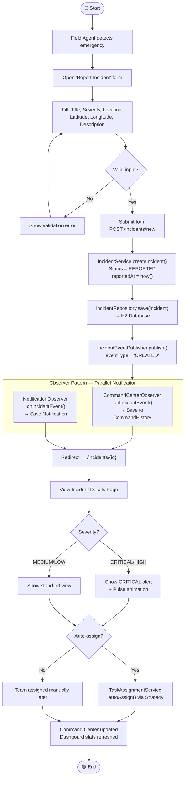

# Activity Diagram 1 — Incident Reporting Flow

## Paste this into draw.io (Extras → Edit Diagram → Mermaid)

```mermaid
flowchart TD
    START(["🔴 Start"])
    FA["Field Agent detects emergency"]
    OPEN["Open 'Report Incident' form"]
    FILL["Fill: Title, Severity, Location,\nLatitude, Longitude, Description"]
    VALIDATE{Valid input?}
    ERR["Show validation error"]
    SUBMIT["Submit form\nPOST /incidents/new"]
    SAVE["IncidentService.createIncident()\nStatus = REPORTED\nreportedAt = now()"]
    PERSIST["incidentRepository.save(incident)\n→ H2 Database"]
    PUBLISH["IncidentEventPublisher.publish()\neventType = 'CREATED'"]

    subgraph OBSERVER ["Observer Pattern — Parallel Notification"]
        direction LR
        OBS1["CommandCenterObserver\n.onIncidentEvent()\n→ Save to CommandHistory"]
        OBS2["NotificationObserver\n.onIncidentEvent()\n→ Save Notification"]
    end

    REDIRECT["Redirect → /incidents/{id}"]
    VIEW["View Incident Details Page"]
    SEVERITY{Severity?}
    CRITICAL["Show CRITICAL alert\n+ Pulse animation"]
    NORMAL["Show standard view"]
    AUTO{Auto-assign?}
    STRATEGY["TaskAssignmentService\n.autoAssign() via Strategy"]
    NONE["Team assigned manually later"]
    DASHBOARD["Command Center updated\nDashboard stats refreshed"]
    END(["🟢 End"])

    START --> FA
    FA --> OPEN
    OPEN --> FILL
    FILL --> VALIDATE
    VALIDATE -->|No| ERR
    ERR --> FILL
    VALIDATE -->|Yes| SUBMIT
    SUBMIT --> SAVE
    SAVE --> PERSIST
    PERSIST --> PUBLISH
    PUBLISH --> OBSERVER
    OBS1 --> REDIRECT
    OBS2 --> REDIRECT
    REDIRECT --> VIEW
    VIEW --> SEVERITY
    SEVERITY -->|CRITICAL/HIGH| CRITICAL
    SEVERITY -->|MEDIUM/LOW| NORMAL
    CRITICAL --> AUTO
    NORMAL --> AUTO
    AUTO -->|Yes| STRATEGY
    AUTO -->|No| NONE
    STRATEGY --> DASHBOARD
    NONE --> DASHBOARD
    DASHBOARD --> END
```
