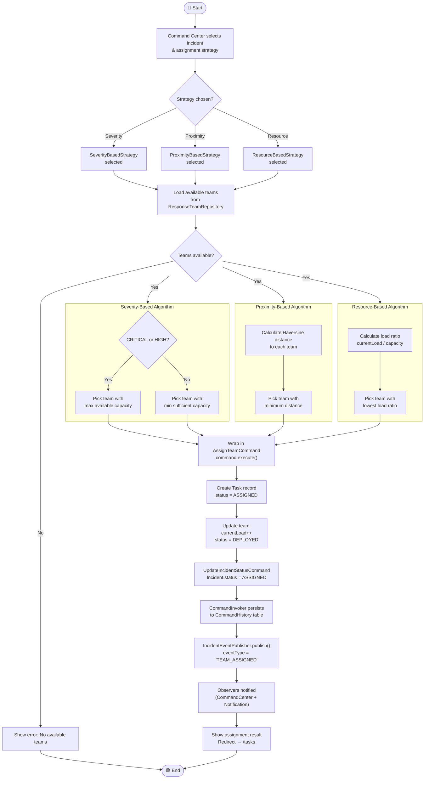

# Activity Diagram 2 — Task Assignment (Strategy Pattern)

## Paste this into draw.io (Extras → Edit Diagram → Mermaid)

```mermaid
flowchart TD
    START(["🔴 Start"])
    OPERATOR["Command Center selects incident\n& assignment strategy"]
    STRATEGY_SEL{Strategy chosen?}

    SEV["SeverityBasedStrategy\nselected"]
    PROX["ProximityBasedStrategy\nselected"]
    RES["ResourceBasedStrategy\nselected"]

    LOAD["Load available teams\nfrom ResponseTeamRepository"]
    EMPTY{Teams available?}
    ERR["Show error: No available teams"]

    subgraph SEVERITY_ALG ["Severity-Based Algorithm"]
        S1{CRITICAL or HIGH?}
        S2["Pick team with\nmax available capacity"]
        S3["Pick team with\nmin sufficient capacity"]
    end

    subgraph PROXIMITY_ALG ["Proximity-Based Algorithm"]
        P1["Calculate Haversine distance\nto each team"]
        P2["Pick team with\nminimum distance"]
    end

    subgraph RESOURCE_ALG ["Resource-Based Algorithm"]
        R1["Calculate load ratio\ncurrentLoad / capacity"]
        R2["Pick team with\nlowest load ratio"]
    end

    CMD["Wrap in AssignTeamCommand\ncommand.execute()"]
    CREATE_TASK["Create Task record\nstatus = ASSIGNED"]
    UPDATE_TEAM["Update team:\ncurrentLoad++\nstatus = DEPLOYED"]
    UPDATE_INCIDENT["UpdateIncidentStatusCommand\nIncident.status = ASSIGNED"]
    PERSIST_CMD["CommandInvoker persists\nto CommandHistory table"]
    NOTIFY["IncidentEventPublisher.publish()\neventType = 'TEAM_ASSIGNED'"]
    OBS["Observers notified\n(CommandCenter + Notification)"]
    RESULT["Show assignment result\nRedirect → /tasks"]
    END(["🟢 End"])

    START --> OPERATOR
    OPERATOR --> STRATEGY_SEL
    STRATEGY_SEL -->|"Severity"| SEV
    STRATEGY_SEL -->|"Proximity"| PROX
    STRATEGY_SEL -->|"Resource"| RES

    SEV --> LOAD
    PROX --> LOAD
    RES --> LOAD

    LOAD --> EMPTY
    EMPTY -->|No| ERR
    ERR --> END

    EMPTY -->|Yes| SEVERITY_ALG
    EMPTY -->|Yes| PROXIMITY_ALG
    EMPTY -->|Yes| RESOURCE_ALG

    S1 -->|Yes| S2
    S1 -->|No| S3

    P1 --> P2
    R1 --> R2

    S2 --> CMD
    S3 --> CMD
    P2 --> CMD
    R2 --> CMD

    CMD --> CREATE_TASK
    CREATE_TASK --> UPDATE_TEAM
    UPDATE_TEAM --> UPDATE_INCIDENT
    UPDATE_INCIDENT --> PERSIST_CMD
    PERSIST_CMD --> NOTIFY
    NOTIFY --> OBS
    OBS --> RESULT
    RESULT --> END
```
