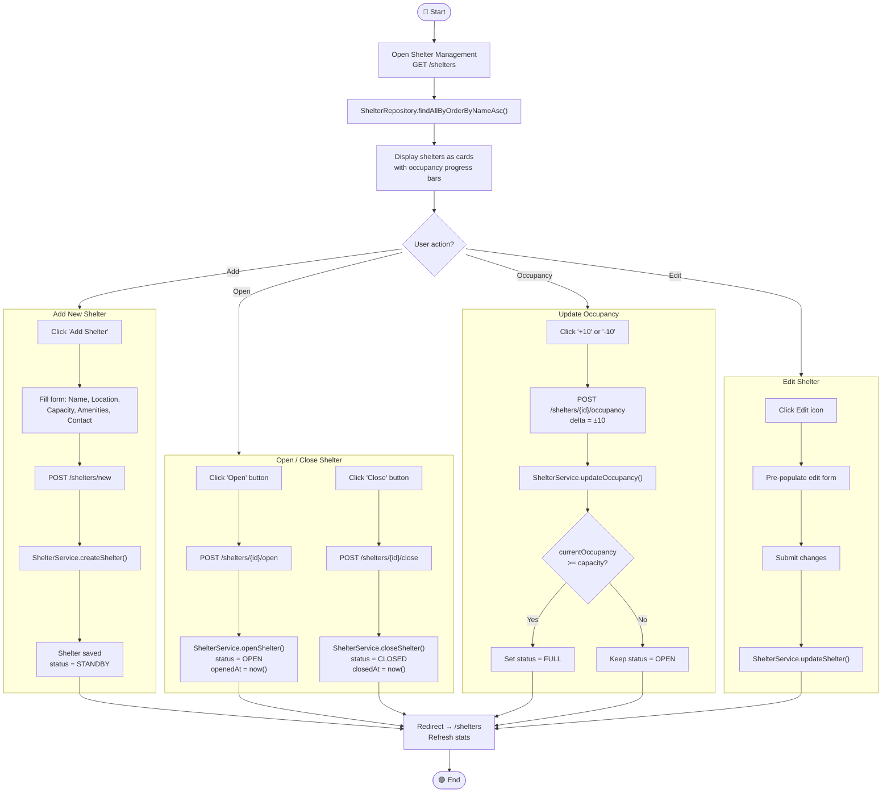

# Activity Diagram 3 — Shelter Management

## Paste this into draw.io (Extras → Edit Diagram → Mermaid)

```mermaid
flowchart TD
    START(["🔴 Start"])
    VIEW_LIST["Open Shelter Management\nGET /shelters"]
    LOAD["ShelterRepository.findAllByOrderByNameAsc()"]
    SHOW["Display shelters as cards\nwith occupancy progress bars"]
    ACTION{User action?}

    subgraph ADD ["Add New Shelter"]
        A1["Click 'Add Shelter'"]
        A2["Fill form: Name, Location,\nCapacity, Amenities, Contact"]
        A3["POST /shelters/new"]
        A4["ShelterService.createShelter()"]
        A5["Shelter saved\nstatus = STANDBY"]
    end

    subgraph OPEN_CLOSE ["Open / Close Shelter"]
        OC1["Click 'Open' button"]
        OC2["POST /shelters/{id}/open"]
        OC3["ShelterService.openShelter()\nstatus = OPEN\nopenedAt = now()"]
        OC4["Click 'Close' button"]
        OC5["POST /shelters/{id}/close"]
        OC6["ShelterService.closeShelter()\nstatus = CLOSED\nclosedAt = now()"]
    end

    subgraph OCCUPANCY ["Update Occupancy"]
        OCC1["Click '+10' or '-10'"]
        OCC2["POST /shelters/{id}/occupancy\ndelta = ±10"]
        OCC3["ShelterService.updateOccupancy()"]
        FULL{currentOccupancy\n>= capacity?}
        OCC4["Set status = FULL"]
        OCC5["Keep status = OPEN"]
    end

    subgraph EDIT ["Edit Shelter"]
        E1["Click Edit icon"]
        E2["Pre-populate edit form"]
        E3["Submit changes"]
        E4["ShelterService.updateShelter()"]
    end

    REDIRECT["Redirect → /shelters\nRefresh stats"]
    END(["🟢 End"])

    START --> VIEW_LIST
    VIEW_LIST --> LOAD
    LOAD --> SHOW
    SHOW --> ACTION

    ACTION -->|"Add"| ADD
    ACTION -->|"Open"| OPEN_CLOSE
    ACTION -->|"Occupancy"| OCCUPANCY
    ACTION -->|"Edit"| EDIT

    A1 --> A2 --> A3 --> A4 --> A5 --> REDIRECT
    OC1 --> OC2 --> OC3 --> REDIRECT
    OC4 --> OC5 --> OC6 --> REDIRECT
    OCC1 --> OCC2 --> OCC3 --> FULL
    FULL -->|Yes| OCC4 --> REDIRECT
    FULL -->|No| OCC5 --> REDIRECT
    E1 --> E2 --> E3 --> E4 --> REDIRECT

    REDIRECT --> END
```
