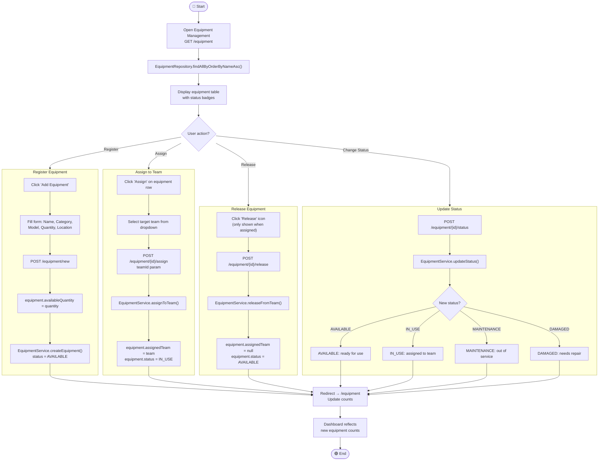

# Activity Diagram 4 — Equipment Tracking & Allocation

## Paste this into draw.io (Extras → Edit Diagram → Mermaid)

```mermaid
flowchart TD
    START(["🔴 Start"])
    VIEW["Open Equipment Management\nGET /equipment"]
    LOAD["EquipmentRepository.findAllByOrderByNameAsc()"]
    SHOW["Display equipment table\nwith status badges"]
    ACTION{User action?}

    subgraph ADD_EQ ["Register Equipment"]
        AE1["Click 'Add Equipment'"]
        AE2["Fill form: Name, Category,\nModel, Quantity, Location"]
        AE3["POST /equipment/new"]
        AE4["equipment.availableQuantity = quantity"]
        AE5["EquipmentService.createEquipment()\nstatus = AVAILABLE"]
    end

    subgraph ASSIGN_EQ ["Assign to Team"]
        AS1["Click 'Assign' on equipment row"]
        AS2["Select target team from dropdown"]
        AS3["POST /equipment/{id}/assign\nteamId param"]
        AS4["EquipmentService.assignToTeam()"]
        AS5["equipment.assignedTeam = team\nequipment.status = IN_USE"]
    end

    subgraph RELEASE_EQ ["Release Equipment"]
        RE1["Click 'Release' icon\n(only shown when assigned)"]
        RE2["POST /equipment/{id}/release"]
        RE3["EquipmentService.releaseFromTeam()"]
        RE4["equipment.assignedTeam = null\nequipment.status = AVAILABLE"]
    end

    subgraph STATUS_EQ ["Update Status"]
        ST1["POST /equipment/{id}/status"]
        ST2["EquipmentService.updateStatus()"]
        ST3{New status?}
        ST4["AVAILABLE: ready for use"]
        ST5["IN_USE: assigned to team"]
        ST6["MAINTENANCE: out of service"]
        ST7["DAMAGED: needs repair"]
    end

    REDIRECT["Redirect → /equipment\nUpdate counts"]
    DASHBOARD["Dashboard reflects\nnew equipment counts"]
    END(["🟢 End"])

    START --> VIEW
    VIEW --> LOAD
    LOAD --> SHOW
    SHOW --> ACTION

    ACTION -->|"Register"| ADD_EQ
    ACTION -->|"Assign"| ASSIGN_EQ
    ACTION -->|"Release"| RELEASE_EQ
    ACTION -->|"Change Status"| STATUS_EQ

    AE1 --> AE2 --> AE3 --> AE4 --> AE5 --> REDIRECT
    AS1 --> AS2 --> AS3 --> AS4 --> AS5 --> REDIRECT
    RE1 --> RE2 --> RE3 --> RE4 --> REDIRECT
    ST1 --> ST2 --> ST3
    ST3 -->|"AVAILABLE"| ST4 --> REDIRECT
    ST3 -->|"IN_USE"| ST5 --> REDIRECT
    ST3 -->|"MAINTENANCE"| ST6 --> REDIRECT
    ST3 -->|"DAMAGED"| ST7 --> REDIRECT

    REDIRECT --> DASHBOARD
    DASHBOARD --> END
```
