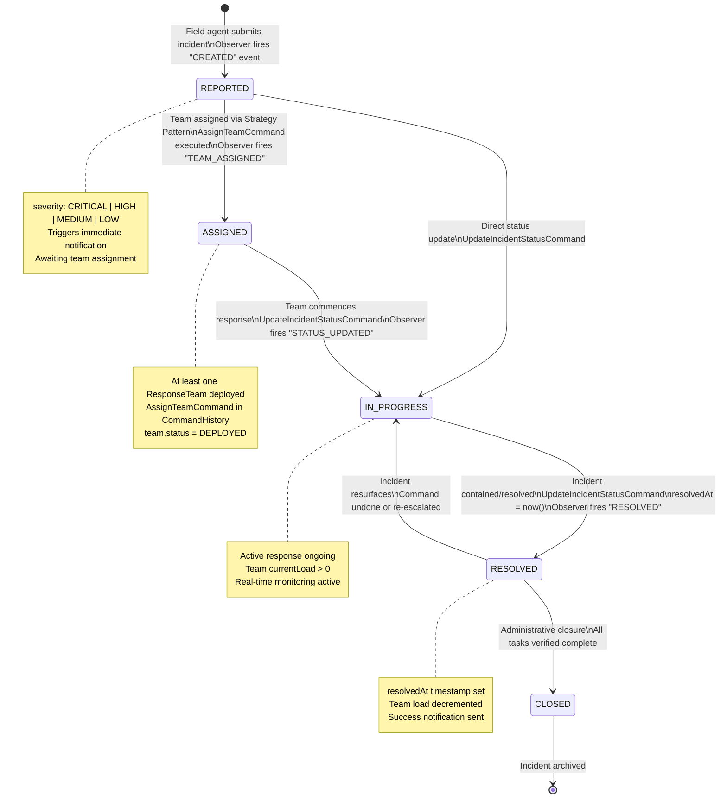

# State Diagram 1 — Incident Status Lifecycle

## Paste this into draw.io (Extras → Edit Diagram → Mermaid)

```mermaid
stateDiagram-v2
    [*] --> REPORTED : Field agent submits incident\nObserver fires "CREATED" event

    REPORTED --> ASSIGNED : Team assigned via Strategy Pattern\nAssignTeamCommand executed\nObserver fires "TEAM_ASSIGNED"

    REPORTED --> IN_PROGRESS : Direct status update\nUpdateIncidentStatusCommand

    ASSIGNED --> IN_PROGRESS : Team commences response\nUpdateIncidentStatusCommand\nObserver fires "STATUS_UPDATED"

    IN_PROGRESS --> RESOLVED : Incident contained/resolved\nUpdateIncidentStatusCommand\nresolvedAt = now()\nObserver fires "RESOLVED"

    RESOLVED --> CLOSED : Administrative closure\nAll tasks verified complete

    RESOLVED --> IN_PROGRESS : Incident resurfaces\nCommand undone or re-escalated

    CLOSED --> [*] : Incident archived

    note right of REPORTED
        severity: CRITICAL | HIGH | MEDIUM | LOW
        Triggers immediate notification
        Awaiting team assignment
    end note

    note right of ASSIGNED
        At least one ResponseTeam deployed
        AssignTeamCommand in CommandHistory
        team.status = DEPLOYED
    end note

    note right of IN_PROGRESS
        Active response ongoing
        Team currentLoad > 0
        Real-time monitoring active
    end note

    note right of RESOLVED
        resolvedAt timestamp set
        Team load decremented
        Success notification sent
    end note
```
