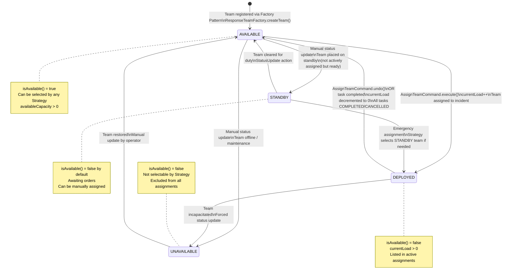

# State Diagram 2 — Response Team Status Lifecycle

## Paste this into draw.io (Extras → Edit Diagram → Mermaid)

```mermaid
stateDiagram-v2
    [*] --> AVAILABLE : Team registered via Factory Pattern\nResponseTeamFactory.createTeam()

    AVAILABLE --> DEPLOYED : AssignTeamCommand.execute()\ncurrentLoad++\nTeam assigned to incident

    AVAILABLE --> STANDBY : Manual status update\nTeam placed on standby\n(not actively assigned but ready)

    AVAILABLE --> UNAVAILABLE : Manual status update\nTeam offline / maintenance

    STANDBY --> AVAILABLE : Team cleared for duty\nStatusUpdate action

    STANDBY --> DEPLOYED : Emergency assignment\nStrategy selects STANDBY team if needed

    DEPLOYED --> AVAILABLE : AssignTeamCommand.undo()\nOR task completed\ncurrentLoad decremented to 0\nAll tasks COMPLETED/CANCELLED

    DEPLOYED --> UNAVAILABLE : Team incapacitated\nForced status update

    UNAVAILABLE --> AVAILABLE : Team restored\nManual update by operator

    note right of AVAILABLE
        isAvailable() = true
        Can be selected by any Strategy
        availableCapacity > 0
    end note

    note right of DEPLOYED
        isAvailable() = false
        currentLoad > 0
        Listed in active assignments
    end note

    note right of STANDBY
        isAvailable() = false by default
        Awaiting orders
        Can be manually assigned
    end note

    note left of UNAVAILABLE
        isAvailable() = false
        Not selectable by Strategy
        Excluded from all assignments
    end note
```
