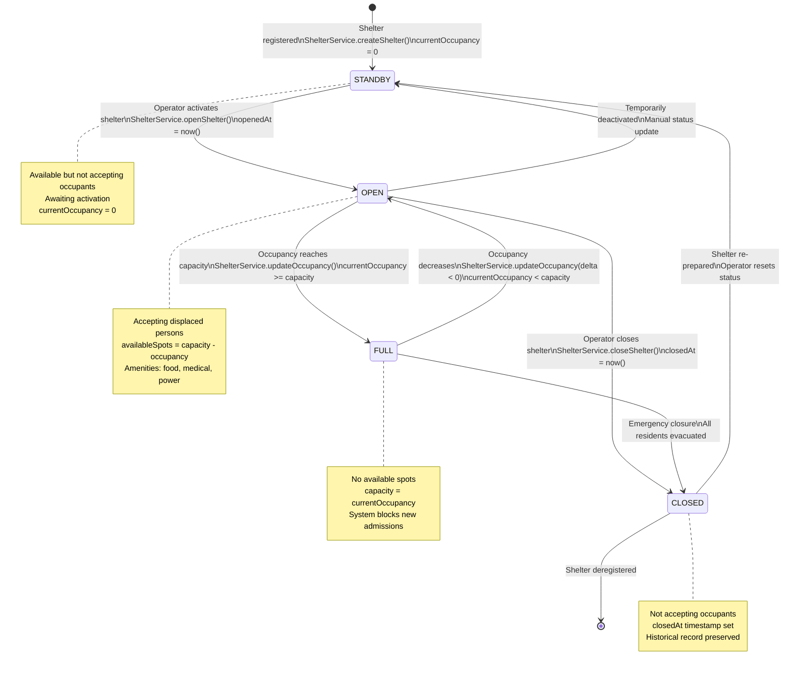

# State Diagram 3 — Shelter Status Lifecycle

## Paste this into draw.io (Extras → Edit Diagram → Mermaid)

```mermaid
stateDiagram-v2
    [*] --> STANDBY : Shelter registered\nShelterService.createShelter()\ncurrentOccupancy = 0

    STANDBY --> OPEN : Operator activates shelter\nShelterService.openShelter()\nopenedAt = now()

    OPEN --> FULL : Occupancy reaches capacity\nShelterService.updateOccupancy()\ncurrentOccupancy >= capacity

    OPEN --> CLOSED : Operator closes shelter\nShelterService.closeShelter()\nclosedAt = now()

    OPEN --> STANDBY : Temporarily deactivated\nManual status update

    FULL --> OPEN : Occupancy decreases\nShelterService.updateOccupancy(delta < 0)\ncurrentOccupancy < capacity

    FULL --> CLOSED : Emergency closure\nAll residents evacuated

    CLOSED --> STANDBY : Shelter re-prepared\nOperator resets status

    CLOSED --> [*] : Shelter deregistered

    note right of STANDBY
        Available but not accepting occupants
        Awaiting activation
        currentOccupancy = 0
    end note

    note right of OPEN
        Accepting displaced persons
        availableSpots = capacity - occupancy
        Amenities: food, medical, power
    end note

    note right of FULL
        No available spots
        capacity = currentOccupancy
        System blocks new admissions
    end note

    note right of CLOSED
        Not accepting occupants
        closedAt timestamp set
        Historical record preserved
    end note
```
