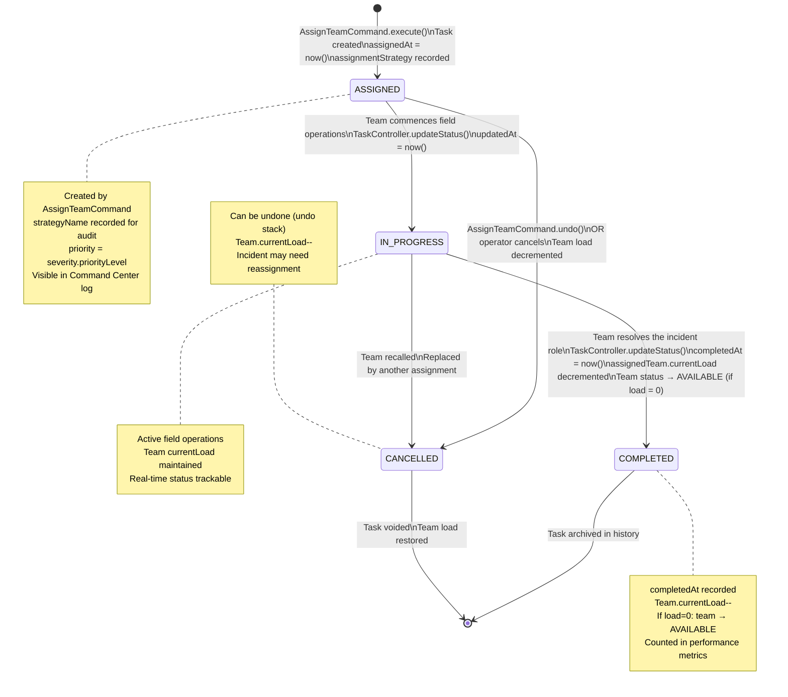

# State Diagram 4 — Task (Assignment) Status Lifecycle

## Paste this into draw.io (Extras → Edit Diagram → Mermaid)

```mermaid
stateDiagram-v2
    [*] --> ASSIGNED : AssignTeamCommand.execute()\nTask created\nassignedAt = now()\nassignmentStrategy recorded

    ASSIGNED --> IN_PROGRESS : Team commences field operations\nTaskController.updateStatus()\nupdatedAt = now()

    ASSIGNED --> CANCELLED : AssignTeamCommand.undo()\nOR operator cancels\nTeam load decremented

    IN_PROGRESS --> COMPLETED : Team resolves the incident role\nTaskController.updateStatus()\ncompletedAt = now()\nassignedTeam.currentLoad decremented\nTeam status → AVAILABLE (if load = 0)

    IN_PROGRESS --> CANCELLED : Team recalled\nReplaced by another assignment

    COMPLETED --> [*] : Task archived in history

    CANCELLED --> [*] : Task voided\nTeam load restored

    note right of ASSIGNED
        Created by AssignTeamCommand
        strategyName recorded for audit
        priority = severity.priorityLevel
        Visible in Command Center log
    end note

    note right of IN_PROGRESS
        Active field operations
        Team currentLoad maintained
        Real-time status trackable
    end note

    note right of COMPLETED
        completedAt recorded
        Team.currentLoad--
        If load=0: team → AVAILABLE
        Counted in performance metrics
    end note

    note left of CANCELLED
        Can be undone (undo stack)
        Team.currentLoad--
        Incident may need reassignment
    end note
```
