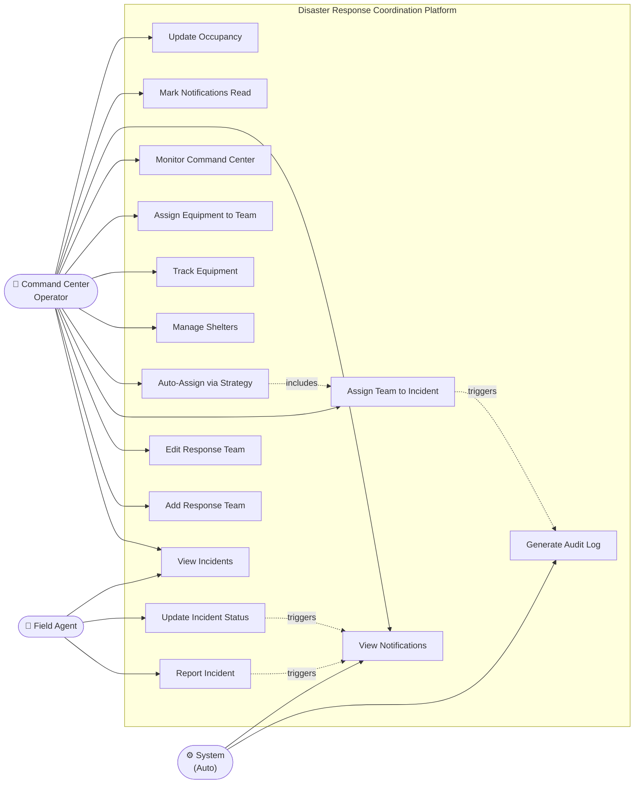

# Use Case Diagram — Disaster Response Coordination Platform

## Paste this into draw.io (Extras → Edit Diagram → Mermaid)

```mermaid
flowchart LR
    FA(["👤 Field Agent"])
    CC(["👤 Command Center\nOperator"])
    SYS(["⚙️ System\n(Auto)"])

    subgraph DRCP ["Disaster Response Coordination Platform"]
        UC1["Report Incident"]
        UC2["Update Incident Status"]
        UC3["View Incidents"]
        UC4["Add Response Team"]
        UC5["Edit Response Team"]
        UC6["Assign Team to Incident"]
        UC7["Auto-Assign via Strategy"]
        UC8["Manage Shelters"]
        UC9["Track Equipment"]
        UC10["Assign Equipment to Team"]
        UC11["Monitor Command Center"]
        UC12["View Notifications"]
        UC13["Mark Notifications Read"]
        UC14["Generate Audit Log"]
        UC15["Update Occupancy"]
    end

    FA --> UC1
    FA --> UC2
    FA --> UC3
    CC --> UC3
    CC --> UC4
    CC --> UC5
    CC --> UC6
    CC --> UC7
    CC --> UC8
    CC --> UC9
    CC --> UC10
    CC --> UC11
    CC --> UC12
    CC --> UC13
    CC --> UC15
    SYS --> UC14
    SYS --> UC12

    UC7 -.->|"includes"| UC6
    UC6 -.->|"triggers"| UC14
    UC1 -.->|"triggers"| UC12
    UC2 -.->|"triggers"| UC12
```
